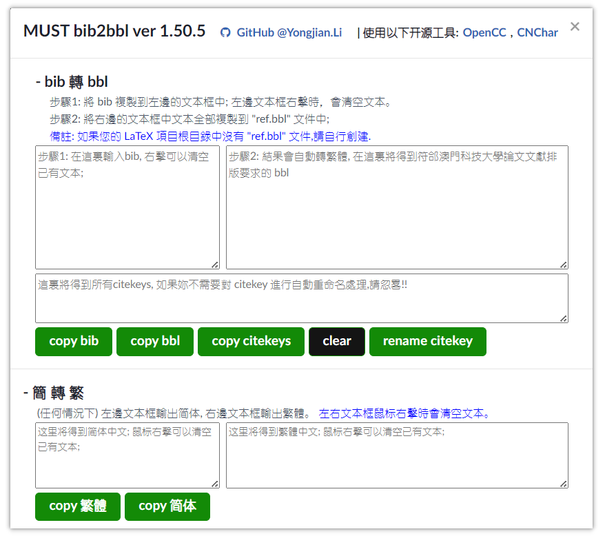

## 鸣谢 

|      | 开 源工具 | GitHub                                                       | call                                                         |
| ---- | --------- | ------------------------------------------------------------ | ------------------------------------------------------------ |
| 1    | CNChar    | https://github.com/theajack/cnchar                           | `cnchar.spell()``cnchar.stroke()`                            |
|      |           | https://theajack.github.io/cnchar/                           | CNChar 在线文档                                              |
|      |           | [cnchar.min.js](https://fastly.jsdelivr.net/npm/cnchar/cnchar.min.js) | 主要调用js                                                   |
|      |           | [cnchar.trad.min.js](https://fastly.jsdelivr.net/npm/cnchar-trad/cnchar.trad.min.js) | cnchar 繁体功能库                                            |
| 2    | OpenCC    | https://github.com/BYVoid/OpenCC                             | `OpenCC.Converter({ from: 'hk', to: 'cn' })`<br />`OpenCC.Converter({ from: 'cn', to: 'hk' })` |
|      |           | [opencc.full.js](https://cdn.jsdelivr.net/npm/opencc-js@1.0.5/dist/umd/full.js) | 主要调用js, 支持简繁互转                                     |
|      |           | [opencc-js CDN files](https://cdn.jsdelivr.net/npm/opencc-js@1.0.5/) | OpenCC CDN 文件目录                                          |


## Overleaf s2t/bib2bbl 1.50.5

除了提供简繁体互转功能之外，它可以将 bib 文献数据处理成符合 澳门科技大学 研究生毕业论文 文献排版格式要求的 bbl 文件。


这是一个能够将bib 文献数据 通过 js 自动转换为符合澳门科技大学关于研究生毕业论文文献排版要求(apa7)的自动化工具.

- bib2bbl 是个html文件,下载打开即可使用;
- crx 是chrom插件, 当打开overleaf 网页时会加载两个按键,分别是 简转繁体以及 bib2bbl 功能按键;





# BibTeX格式期刊文章

**Assistant:**

以下是一个例子，展示了如何使用BibTeX格式来引用一篇期刊文章：

```
@article{smith2020,
  author = {Smith, John and Johnson, Emily},
  title = {The impact of climate change on biodiversity},
  journal = {Nature},
  year = {2020},
  volume = {587},
  number = {7834},
  pages = {393-401},
  month = {November},
  note = {DOI: 10.1038/s41586-020-2705-y}
}

```

在上面的例子中，我们引用了一篇2020年发表在《Nature》杂志上的文章，题为“The impact of climate change on biodiversity”。作者为John Smith和Emily Johnson。该文章发表在第587卷、第7834期，页码为393-401，发表时间为2020年11月。我们还提供了该文章的DOI号码。


***

**Assistant:**

在BibTeX中，`@conference`和`@inproceedings`是等价的类型。以下是一个示例，展示如何使用BibTeX格式引用会议论文：

必要域: author, title, booktitle, year.
可选域: editor, volume/number, series, pages, address, month, organization, publisher, note.

```
@inproceedings{wang2022,
  author = {Wang, Li and Chen, Xiaoyun},
  title = {A machine learning approach for sentiment analysis in social media},
  booktitle = {Proceedings of the 2022 International Conference on Information Retrieval},
  year = {2022},
  pages = {112-120},
  month = {July},
  publisher = {ACM},
  address = {New York, NY, USA},
  note = {DOI: 10.1145/1234567.1234567}
}

```

在上面的例子中，我们引用了一篇2022年发表在“2022年信息检索国际会议”上的论文。文章的作者为Wang Li和Chen Xiaoyun。该论文的题目是“A machine learning approach for sentiment analysis in social media”。论文发表在页面112-120上，出版商为ACM，会议地点为纽约。我们还提供了该论文的DOI号码。


***

**Assistant:**

在BibTeX中，`@book`用于引用公开出版的图书。以下是一个示例，展示如何使用BibTeX格式引用一本图书：

必要域: author/editor, title, publisher, year.
可选域: volume/number, series, address, edition, month, note.

```
@book{greenberg2015,
  author = {Greenberg, Andy},
  title = {This Machine Kills Secrets: How Wikileakers, Cypherpunks, and Hacktivists Aim to Free the World's Information},
  publisher = {Penguin Press},
  year = {2015},
  address = {New York, NY, USA},
  edition = {1st},
  note = {ISBN: 978-1594204428}
}

```

在上面的例子中，我们引用了一本名为“This Machine Kills Secrets: How Wikileakers, Cypherpunks, and Hacktivists Aim to Free the World's Information”的图书。该图书的作者为Andy Greenberg，出版商为Penguin Press，出版年份为2015年。该书出版地点为纽约。该图书的版次为第1版，并提供了该图书的ISBN号码。


***

**Assistant:**

在BibTeX中，`@proceedings`用于引用会议论文集。以下是一个示例，展示如何使用BibTeX格式引用一本会议论文集：

必要域: title, year.
可选域: editor, volume/number, series, address, month, organization, publisher, note.

```
@proceedings{liu2020,
  title = {Proceedings of the 2020 International Conference on Machine Learning},
  year = {2020},
  editor = {Liu, Qiang and Zhang, Ming and Wang, Wei},
  publisher = {IEEE},
  address = {Piscataway, NJ, USA},
  month = {June},
  note = {ISBN: 978-1-7281-9858-2}
}

```

在上面的例子中，我们引用了一本名为“Proceedings of the 2020 International Conference on Machine Learning”的会议论文集。该论文集出版于2020年，由刘强、张明和王伟编辑，由IEEE出版社出版。该论文集出版地点为新泽西州皮斯卡特维。该论文集发表时间为6月份，并提供了该论文集的ISBN号码。


***

**Assistant:**

在BibTeX中，`@inbook`用于引用书籍的一部分章节。以下是一个示例，展示如何使用BibTeX格式引用书籍的一部分章节：

必要域: author/editor, title, chapter and/or pages, publisher, year.
可选域: volume/number, series, type, address, edition, month, note.

```
@inbook{smith2005,
  author = {Smith, John},
  title = {The History of Artificial Intelligence},
  chapter = {3},
  pages = {47-73},
  publisher = {Wiley},
  year = {2005},
  address = {Hoboken, NJ, USA},
  edition = {1st},
  note = {ISBN: 978-0471740632 }
}

```

在上面的例子中，我们引用了一本书的第3章，该章的题目为“The History of Artificial Intelligence”，作者为John Smith。这本书的出版商为Wiley，出版年份为2005年，出版地点为新泽西州霍博肯。该书的第1版，并提供了该书的ISBN号码。被引用的章节出现在页面47到73之间。


***

**Assistant:**

在BibTeX中，`@incollection`用于引用书籍中带有独立标题的章节。以下是一个示例，展示如何使用BibTeX格式引用一本书籍中的一章：
必要域: author, title, booktitle, publisher, year.
可选域: editor, volume/number, series, type, chapter, pages, address, edition, month, note.

```
@incollection{lee2010,
  author = {Lee, Wei-Meng},
  title = {Introduction to Android},
  booktitle = {Beginning Android 2},
  publisher = {Apress},
  year = {2010},
  editor = {Murphy, Mark L.},
  address = {Berkeley, CA, USA},
  pages = {1-16},
  edition = {2nd},
  note = {ISBN: 978-1430226598}
}

```

在上面的例子中，我们引用了一本名为“Beginning Android 2”的书籍中的一章，该章的标题为“Introduction to Android”，作者为Wei-Meng Lee。该书由Mark L. Murphy编辑，由Apress出版社出版。该书的第2版，出版年份为2010年，出版地点为加利福尼亚州伯克利。被引用的章节出现在页面1到16之间，并提供了该书的ISBN号码。


***

**Assistant:**

在BibTeX中，`@mastersthesis`用于引用硕士论文。以下是一个示例，展示如何使用BibTeX格式引用硕士论文：

必要域: author, title, school, year.
可选域: type, address, month, note.

```
@mastersthesis{wang2021,
  author = {Wang, Xiaohui},
  title = {Design and Implementation of a Real-time Image Recognition System},
  school = {Shanghai Jiao Tong University},
  year = {2021},
  type = {Master Thesis},
  address = {Shanghai, China},
  month = {June},
  note = {Available at \url{http://www.example.com}}
}

```

在上面的例子中，我们引用了一篇名为“Design and Implementation of a Real-time Image Recognition System”的硕士论文，作者为Xiaohui Wang。该论文由上海交通大学出版，发表于2021年。该论文的类型为硕士论文，出版地点为中国上海，并在六月份完成。我们还提供了该论文的网址作为备注信息。


***

**Assistant:**

在BibTeX中，`@phdthesis`用于引用博士论文。以下是一个示例，展示如何使用BibTeX格式引用博士论文：

必要域: author, title, year, school.
可选域: address, month, keywords, note.

```
@phdthesis{liu2022,
  author = {Liu, Jun},
  title = {Research on Key Technologies of Intelligent Logistics System},
  year = {2022},
  school = {Tsinghua University},
  address = {Beijing, China},
  month = {January},
  keywords = {Intelligent Logistics, Key Technologies},
  note = {Available at \url{http://www.example.com}}
}

```

在上面的例子中，我们引用了一篇名为“Research on Key Technologies of Intelligent Logistics System”的博士论文，作者为Jun Liu。该论文由清华大学出版，发表于2022年。出版地点为中国北京，完成月份为一月份。我们还提供了该论文的关键词，网址作为备注信息。


***

**Assistant:**

在BibTeX中，`@techreport`用于引用技术报告。以下是一个示例，展示如何使用BibTeX格式引用技术报告：

必要域: author, title, institution, year.
可选域: type, number, address, month, note.

```
@techreport{smith2021,
  author = {Smith, John},
  title = {A Comparative Study of Machine Learning Algorithms},
  institution = {IBM Research},
  year = {2021},
  type = {Technical Report},
  number = {TR-2021-123},
  address = {New York, NY},
  month = {July},
  note = {Available at \url{http://www.example.com}}
}

```

在上面的例子中，我们引用了一篇名为“A Comparative Study of Machine Learning Algorithms”的技术报告，作者为John Smith。该报告由IBM Research出版，发表于2021年，报告类型为技术报告，报告编号为TR-2021-123。出版地点为纽约市，完成月份为七月份。我们还提供了该报告的网址作为备注信息。


***

**Assistant:**

在BibTeX中，`@unpublished`用于引用未出版的论文、图书等。以下是一个示例，展示如何使用BibTeX格式引用未出版的作品：

必要域: author, title, note.
可选域: month, year.

```
@unpublished{zhang2023,
  author = {Zhang, Wei},
  title = {A Study on the Effects of Climate Change on Biodiversity},
  note = {Unpublished manuscript},
  year = {2023},
  month = {April}
}

```

在上面的例子中，我们引用了一篇名为“A Study on the Effects of Climate Change on Biodiversity”的未出版论文，作者为Wei Zhang。该论文于2023年4月完成，尚未出版，我们在note中注明了这一点。


***

**Assistant:**

在BibTeX中，`@misc`用于引用一些无法归类到其他类别的参考文献，比如网址、软件、数据集等。以下是一个示例，展示如何使用BibTeX格式引用一个网址：

必要域: none
可选域: author, title, howpublished, month, year, note.

```
@misc{example,
  author = {Example Inc.},
  title = {Example Website},
  howpublished = {\url{http://www.example.com}},
  year = {2023},
  note = {Accessed on 2023-04-06}
}

```

在上面的例子中，我们引用了一个名为“Example Website”的网站，作者为Example Inc.。我们使用了`\url`命令将网址格式化输出，以便于读者直接在参考文献中点击链接进行访问。该网站的访问时间为2023年4月6日，我们在note中注明了这一点。


***

form chatGPT: 2023年4月6日 下午0:44.


## BibTeX支持的全部条目类型如下：

article: 期刊或杂志上的文章
conference: 会议论文
inproceedings: 会议论文与 conference 相同
book: 书籍
booklet: 和book一样，但没有指定的出版商
inbook: 书中的一章或一节
incollection: 论文集中的文章
manual: 技术手册
masterthesis: 硕士论文
phdthesis: 博士论文
proceedings: 整个会议记录
techreport: 技术报告，政府报告或白皮书
unpublished: 尚未正式出版的作品
misc: 如果没有其他合适的可以使用，则使用 misc，比如网址，邮件等。

## 条目下全部的字段类型如下：

title: 论文名称
author: 作者名单
journal: 文章发表的期刊或杂志名称
booktitle: 书名，论文集的名称或会议名称
month: 作品出版的月份
year: 出版的年份
volume: 卷号
number: 报告号或期刊文章的刊号
pages: 文章所在书籍或论文集中的页码或页范围
address: 出版商地址或会议举办的地址
organization: 组织或赞助会议或出版手册的机构名称，如 IEEE/ACM/Springer
annote: 注释
chapter: 书中的章节编号
edition: 书的版本号
editor: 书或者论文集的编辑名单
howpublished: 特别出版物的出版通知
institution: 发表及/或赞助报告的机构名称
note: 关于参考文献的说明
publisher: 出版社
school: 大学或学位授予机构名称
series: name of the series or set of books
type: 技术报告或论文的类型

## 非标准字段类型 （这些字段经常使用，但并非所有BibTeX样式都支持）

doi: DOI number (like 10.1038/d41586-018-07848-2) Add to Citavi project by DOI
issn: ISSN number (like 1476-4687)
isbn: ISBN number (like 9780201896831 Add to Citavi project by ISBN)
url: URL of a web page